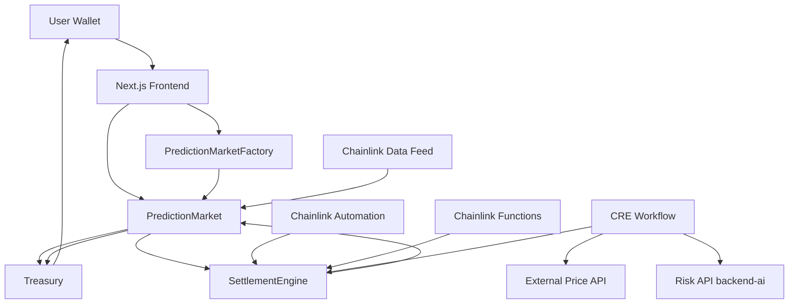
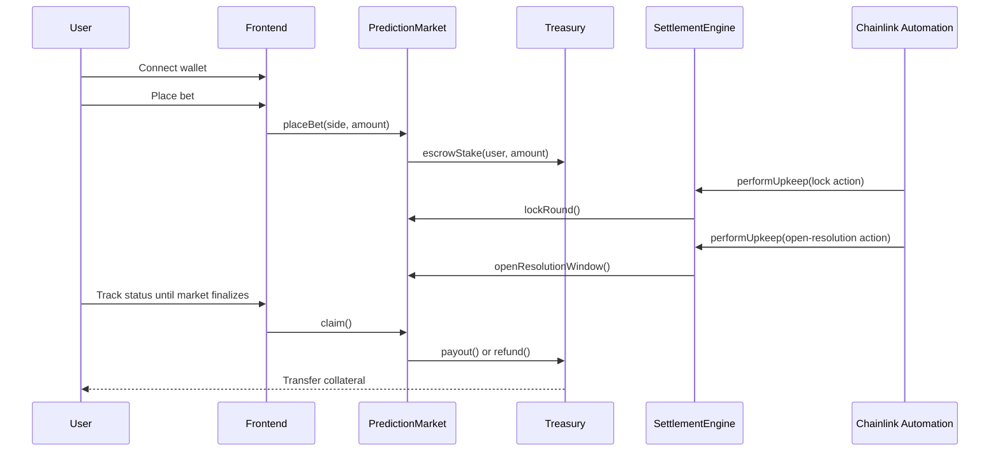
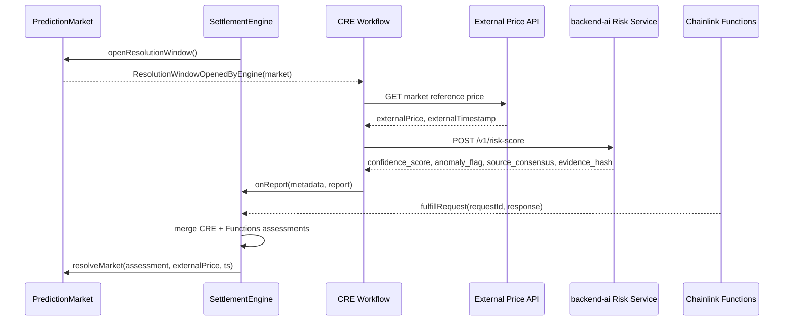
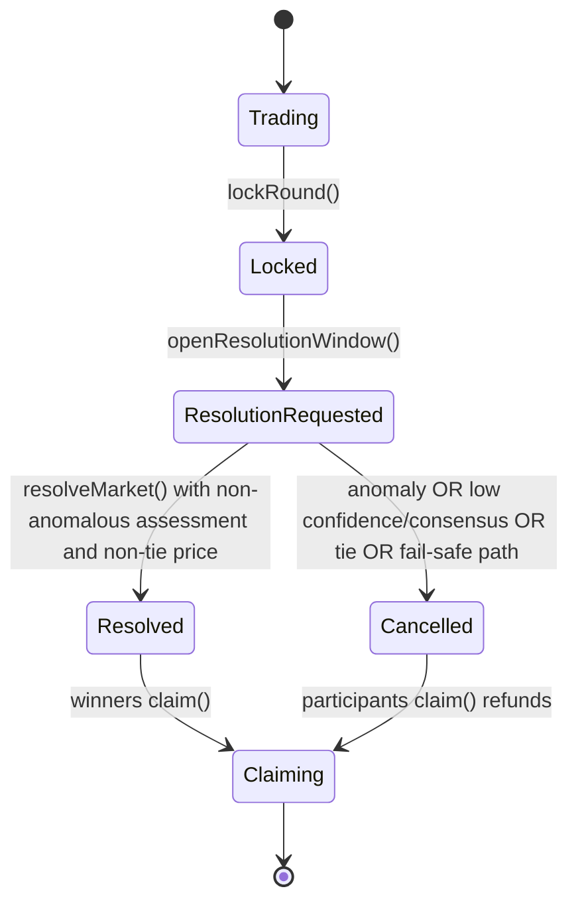
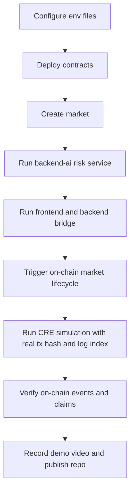

# DEEPSEER

Production-grade decentralized AI-assisted prediction market system.

## What Is Included

- Existing Next.js app layout under `src/` with upgraded DEEPSEER trade terminal UI at `src/app/trade/page.tsx`.
- Legacy protocol contracts under `contracts/deepseer/` (kept intact).
- New production contract suite under `contracts/src/`:
  - `PredictionMarketFactory.sol`
  - `PredictionMarket.sol`
  - `SettlementEngine.sol`
  - `Treasury.sol`
  - `interfaces/RiskOracleInterface.sol`
- CRE workflow under `cre-workflows/deepseer-settlement/`.
- Deterministic FastAPI risk microservice under `backend-ai/`.
- Security, architecture, deployment, and demo runbooks under `docs/`.

REAL mode is the default system path. Demo mode is explicitly labeled in the trade UI.

## Repository Structure

```text
/src                Existing frontend app (App Router pages/components)
/backend            Existing API + websocket bridge
/contracts/deepseer Legacy contracts (preserved)
/contracts/src      Production contract suite (new)
/contracts/script   Production deployment script (new)
/backend-ai         FastAPI deterministic risk service (new)
/cre-workflows      Chainlink CRE workflow project (new)
/deploy             Address templates and deployment runbook (new)
/docs               Architecture/security/demo/public checklist (new)
/tests              E2E scenario matrix (new)
/scripts            Bootstrap/deploy/sim helpers (new + existing)
```

## Chainlink Stack

- Data Feeds: lock/final price snapshots in market resolution logic.
- Automation: lock-round/open-resolution upkeep logic in `SettlementEngine`.
- Functions: independent risk request tracking and merge gate.
- CRE: event trigger -> external fetch -> AI risk score -> signed on-chain report.

References: `docs/chainlink-references.md`

## Whole Project Workflow

End-to-end workflow across frontend, contracts, Chainlink services, CRE orchestration, and payout settlement:



## User Workflow

Lifecycle from user action to final claim:



## CRE Workflow

Detailed CRE orchestration path for offchain data and report submission:



## Settlement Lifecycle

Market state machine and deterministic resolution/cancel behavior:



## Operations Workflow

Practical project runbook path from setup to submission evidence:



## Chainlink File Index

README pointer list for all files that directly integrate Chainlink services and CRE flow:

- `contracts/src/PredictionMarket.sol` (Data Feeds via `AggregatorV3Interface`)
- `contracts/src/SettlementEngine.sol` (Automation + Functions + CRE report ingestion)
- `contracts/script/DeployDeepseer.s.sol` (Functions/CRE deployment wiring)
- `contracts/functions/risk-default.js` (default Chainlink Functions source script)
- `contracts/.env.example` (Chainlink router, DON, forwarder, feed config inputs)
- `cre-workflows/project.yaml` (CRE target RPC/workflow-owner config)
- `cre-workflows/deepseer-settlement/main.ts` (CRE event trigger from on-chain settlement event)
- `cre-workflows/deepseer-settlement/externalData.ts` (external API fetch in workflow)
- `cre-workflows/deepseer-settlement/risk.ts` (risk API call with CRE secret)
- `cre-workflows/deepseer-settlement/evm.ts` (signed on-chain report submit via `writeReport`)
- `cre-workflows/deepseer-settlement/workflow.yaml` (workflow package wiring)
- `cre-workflows/deepseer-settlement/config.json` (chain selector, receiver address, APIs)
- `cre-workflows/secrets.yaml.example` (required secret template)
- `docs/chainlink-references.md` (official docs + simulation steps)

## Submission Links (Fill Before Submit)

- Public video (3-5 min): `TODO_ADD_PUBLIC_VIDEO_URL`
- Public source repo: `TODO_ADD_PUBLIC_REPO_URL`

## Frontend Terminal

`src/app/trade/page.tsx` now includes:

- Round-based top timeline with active neon indicator
- Left vertical bull/bear strength axis
- Realtime chart panel
- Wallet area
- Bet panel with quick amounts + custom input
- Balance, P/L, total winnings, total staked, win rate cards
- Bets history table

Theme: blue/violet neon, dark-only, glassmorphism-style panels.

## Backend AI Service

`backend-ai` exposes deterministic risk scoring:

- `POST /v1/risk-score`
- Output fields:
  - `confidence_score`
  - `anomaly_flag`
  - `source_consensus`
  - `evidence_hash`

## Quick Run

1. Install JavaScript dependencies:

```bash
npm install
```

2. Create `.env` from `.env.example` and fill required RPC + contract values:

```powershell
Copy-Item .env.example .env
```

3. Run frontend (Next.js):

```bash
npm run dev
```

4. Run backend API/WebSocket bridge (default port `4000`, change if needed):

```bash
npm run backend
```

5. Run AI risk service:

```bash
python -m pip install -r backend-ai/requirements.txt
python -m uvicorn backend-ai.app.main:app --host 127.0.0.1 --port 8011
```

## Deployment And Simulation

- Deployment guide: `docs/deployment-guide.md`
- CRE simulation: `docs/chainlink-references.md`
- Full architecture and sequence: `docs/architecture.md`
- Threat model: `docs/security-checklist.md`
- Demo outline (3-5 min): `docs/demo-script.md`

Useful commands:

- `npm run sync:cre` to sync CRE env/config from deployment files.
- `npm run preflight:submission` to validate strict submission readiness.

## CRE Ops Notes

### 1) Correct CRE env format

`cre-workflows/.env` must have exactly one assignment per key:

```env
RISK_API_KEY=your-strong-random-key
RPC_URL=https://sepolia.infura.io/v3/<YOUR_KEY>
WORKFLOW_OWNER_ADDRESS=0xYourWorkflowOwnerAddress
```

Set the same `RISK_API_KEY` in `backend-ai/.env`.

### 2) Deploy access can be gated

If `cre workflow deploy` fails with organization status `GATED`, this is an access-policy limitation, not a code bug.
Use the simulation path for submission and request deploy access at:

`https://cre.chain.link/request-access`

### 3) Simulation requires a real trigger event

`ResolutionWindowOpenedByEngine` must exist on-chain first. A placeholder hash like `0x<REAL_TX_HASH>` or `0x000...000` will fail.

Interactive simulate:

```powershell
cd cre-workflows
cre workflow simulate deepseer-settlement --target local-simulation -e .env -v
```

Non-interactive simulate (use real values, no angle brackets):

```powershell
cre workflow simulate deepseer-settlement --target local-simulation -e .env --non-interactive --trigger-index 0 --evm-tx-hash 0xabc123... --evm-event-index 0 -v
```

### 4) Common CRE errors and fixes

- `invalid scheme in RPC URL`:
  - Ensure `cre-workflows/.env` has valid `RPC_URL=https://...`.
- `CRE SDK Javy plugin not found`:
  - Run `bun x cre-setup` inside `cre-workflows/deepseer-settlement`.
- `transaction hash cannot be empty` or `receipt not found`:
  - Provide a real tx hash and log index for `ResolutionWindowOpenedByEngine`.

## Strict Preflight (REAL Mode)

Before submission, verify the following are fully configured:

- `contracts/.env`: set `FUNCTIONS_SOURCE` or `FUNCTIONS_SOURCE_FILE` for production Chainlink Functions logic.
- `contracts/.env`: `MARKET_PRICE_FEED`, `FUNCTIONS_ROUTER`, `CRE_FORWARDER`, and `FUNCTIONS_DON_ID` match target network.
- `cre-workflows/deepseer-settlement/config.json`: `settlementEngineAddress` is a real deployed address (not zero address).
- `cre-workflows/.env`: includes `RPC_URL` and `WORKFLOW_OWNER_ADDRESS`.
- `cre-workflows/secrets.yaml`: created from example and contains `RISK_API_KEY`.

## Important Notes

- No mock oracle settlement path is used in REAL mode.
- No admin outcome override path exists in the production contract suite.
- Functions outage path fails safe by forcing anomaly/cancellation behavior.
