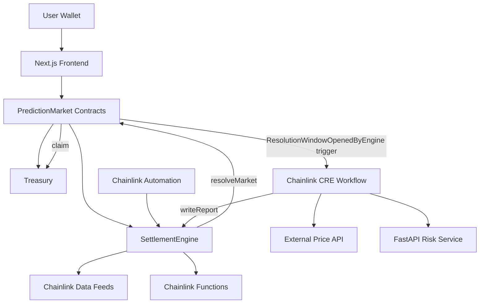
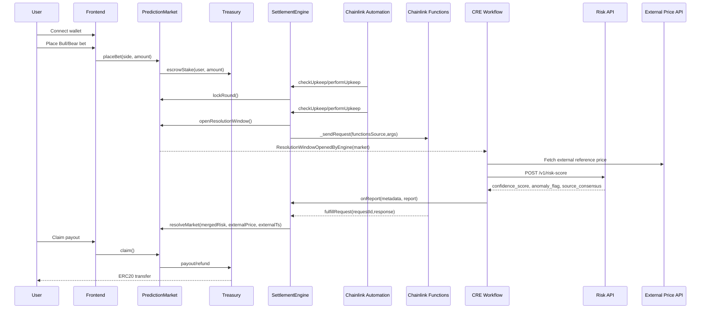

# DEEPSEER Architecture

## System Topology

## Responsibility Split

- `PredictionMarket`: round lifecycle, oracle lock/final read, deterministic outcome derivation, payout math.
- `Treasury`: escrow accounting per market, protocol fee capture, payout/refund transfers.
- `SettlementEngine`: Automation hooks, Functions request/fulfillment tracking, CRE report verification and merge logic.
- `PredictionMarketFactory`: controlled market deployment, treasury market authorization, settlement engine registration.
- `backend-ai`: deterministic reliability scoring over multi-source observations.
- `cre-workflows/deepseer-settlement`: event trigger + external fetch + AI call + signed on-chain report.
- `src/` frontend app: trading terminal UI, wallet actions, bet controls, market telemetry.

## Resolution Data Path

1. Automation detects expired locked market.
2. `SettlementEngine.performUpkeep` opens resolution window and sends Functions request.
3. CRE sees `ResolutionWindowOpenedByEngine` event.
4. CRE fetches external price and risk score, submits `onReport` payload.
5. Settlement engine merges Functions + CRE reports (or fail-safe if Functions times out).
6. `PredictionMarket.resolveMarket` reads Chainlink Data Feed and derives Bull/Bear from `finalPrice` vs `lockPrice`.
7. Users claim rewards/refunds from treasury escrow.

## Full User Sequence Diagram

